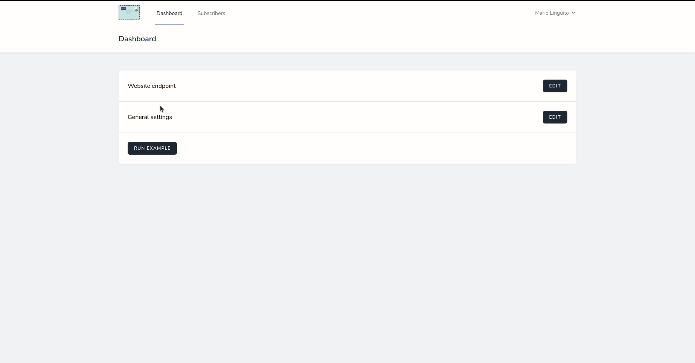
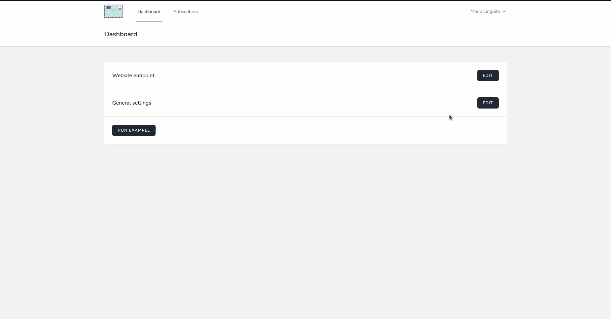
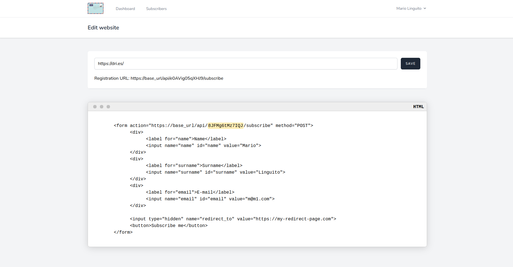
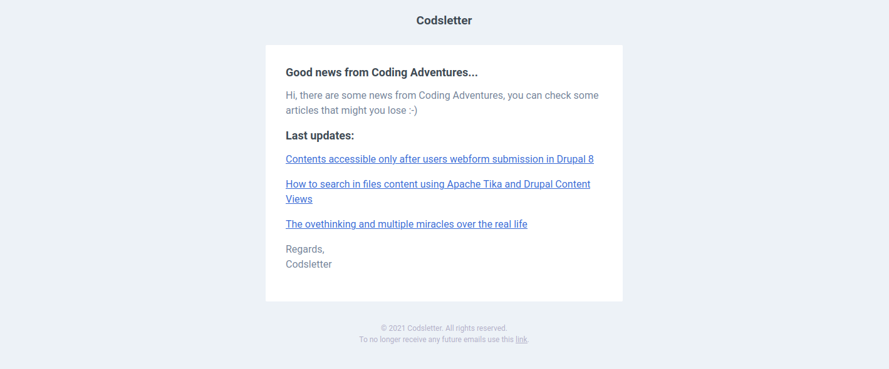

## About Codsletter

Codsletter is a free-to-use open-source web application that you can use to create a recurrent and automatically newsletter for your blog.

In particular, you can: 

- Add your website as a source for the newsletter,
- Select the number of the days and the minimum number of the posts to reach to sending the newsletter,
- Describe an object and a headline for the personalization of your e-mail, 
- You can create an HTML form for your subscribers and put it where you want;

## How Codsletter works

Codsletter works automatically by sending a newsletter to your subscribers when reaching the days and the minimum number of posts you set previously into the system. 

**An example:** if you set 7 as the number of days for scheduling, and 3 as the minimum number of posts to reach before sending the e-mails, so the system checks every day that the number of days (since today) is greater or equal to the number of days you set, then check if the number of posts is greater or equal to the number of posts you wrote since the last run, and if these two events are satisfied, the system sends the newsletter to every your subscribers.

## How to signup to Codsletter
To signup for the application, you need at least an e-mail address that you can verify. If this requirement is satisfied, you can put your information on the **[/register](http://codsletter.herokuapp.com/register)** page.

The application will send you a confirmation e-mail, so you can click on the verification button or copy and paste the link into your browser address space.

## How to configure Codsletter

We can configure the application in two steps.

### First step: website endpoint
The first step is to set the website endpoint from which the application will retrieve the information (posts). 

You can click on the button *Edit* related to the row *Website endpoint* or write this on your browser **[/edit-website](http://codsletter.herokuapp.com/edit-website)**. 

There is only one text input in which you should write your website endpoint (URL). Then, you should click on the *Save* button. 

After that, if you click again on *Edit* related to *Website endpoint*, you can check your unique token used for creating your HTML forms and put them on your website or where you want.

The application creates for you an example of an HTML form, but you can use the token and the API endpoint to make your forms using your style.

PS. You can set a redirect page where subscribers will be redirected after the registration. For this, you can edit the hidden input with the name _redirect_to_.

### Second step: general settings

Clicking on the *Edit* button related to *General settings* we can specify some information about our website: 

1. _Scheduler_: the number of days after the system can send an e-mail to your subscribers. Warning, the application run a CRON every day, so your website will be scanned every single day,

2. _Posts number_: the number of posts to reach to send an e-mail to all your subscribers. So, if the number of the days are more than the number of the days set (scheduler) and there are N news posts (posts number) since the last sending, the application will send the newsletter,

3. _Title tag_: this is the HTML tag related to the title of the posts. We can make two examples for understanding this setting: 
- If you want to get the title tag of the posts in my blog, you can inspect one of the elements (post) and get the tag: [IMG] so the tag is: _article h3 a_
- If you want to get the title tag of the posts of Dries Buytaert (the creator of Drupal CMS), you can do the same thing we done before: [IMG] so the tag is: a.u-url

4. _Email object_: this is the object of the newsletter that will be sent to the subscribers, 

5. _Headline_: this is the introduction of the e-mail, a simple text that comes before the list of the last posts;

PS. After you save the settings, you can test your website using the button *RUN EXAMPLE*, so you can see if the information is retrieved well.

## Where I can see my subscribers
Subscribers are listed on **[/subscribers](http://codsletter.herokuapp.com/subscribers)** page. Each one can have a name, surname and an e-mail.

You can delete any user, without notifying him of this operation.

## How my users can subscribe

Your users can subscribe to Codsletter using the form you can find and personalize into the website settings: 

You can personalize the destination URL for the successful event of subscription, and the whole design of the form adapting it to your website or blog.

An example of a newsletter sent by Codsletter:

