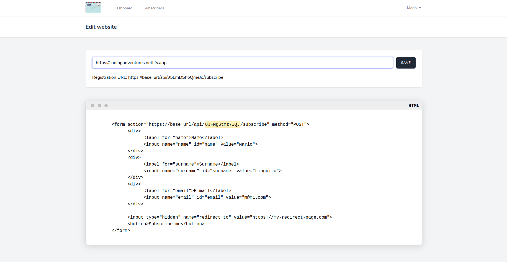

## About Codsletter

With Codsletter, you can turn your blog into a periodical newsletter with few clicks and some configuration. 

In particular, you can: 

- Add your website as a source for the newsletter,
- Select the number of the days and the minimum number of the posts to reach to sending the newsletter,
- Describe an object and a headline for the personalization of your e-mail, 
- You can create an HTML form for your subscribers and put it where you want;

## How Codsletter works

Codsletter works automatically by sending a newsletter to your subscribers when reaching the days and the minimum number of posts you set previously into the system. 

**An example:** if you set 7 as the number of days for scheduling, and 3 as the minimum number of posts to reach before sending the e-mails, so the system checks every day that the number of days (since today) is greater or equal to the number of days you set, then check if the number of posts is greater or equal to the number of posts you wrote since the last run, and if these two events are satisfied, the system sends the newsletter to every your subscribers.

## How to set this information

After the registration, you should set the URL of your website into the system as a source. The link is: **[website settings](http://codsletter.herokuapp.com/edit-website)**

After that, you should set the following information: **[scheduler settings](http://codsletter.herokuapp.com/edit-settings)**: 
The minimum number of days to reach, 
The minimum number of posts to reach, 
The object of your e-mail, 
The headline of your e-mail;

## How my users can subscribe

Your users can subscribe to Codsletter using the form you can find and personalize into the website settings: 

You can personalize the destination URL for the successful event of subscription, and the whole design of the form adapting it to your website or blog.

An example of a newsletter sent by Codsletter:
 

## Todo list: future features (want you give me an hand?)

- Add the possibility to manage personal SMTP account so users can personalize better the newsletter,
- Add the possibility to manage multiple templates and blocks inside them;